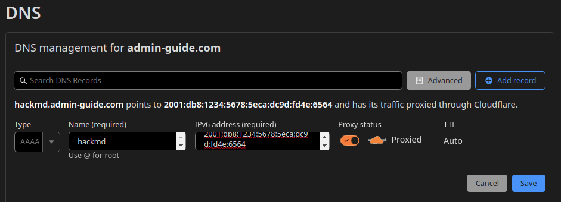
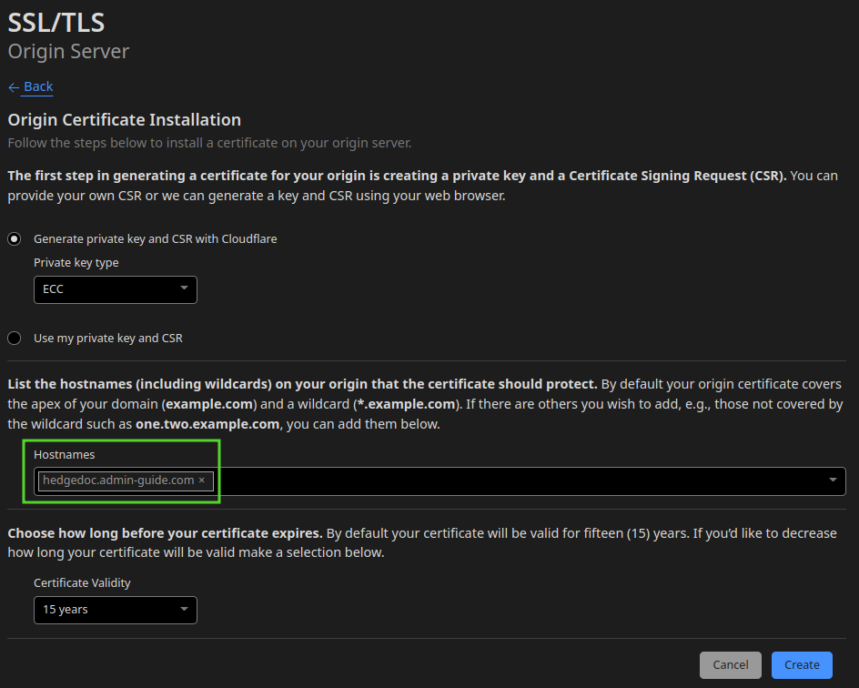
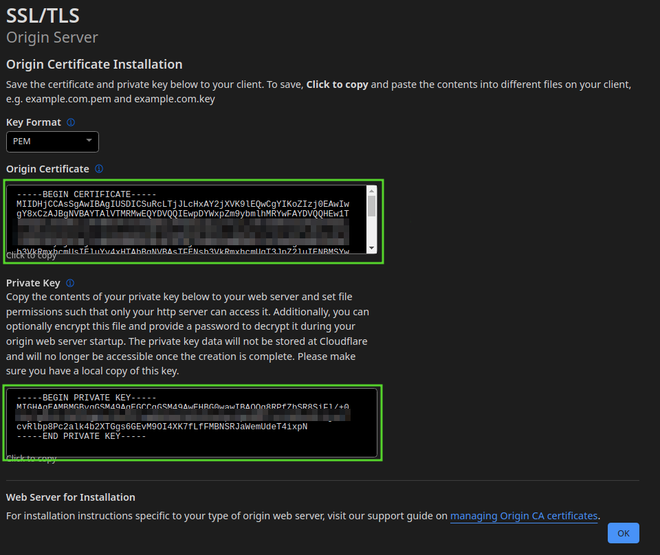

# NGINX setup

As mentioned in the introduction we are going to use a nginx as reverse proxy.

The installation is quiet simple:
```shell
sudo apt install nginx-full
```

To verify the mTLS client certificates, we need to cloudflare origin pull ca:
```shell
wget https://developers.cloudflare.com/ssl/static/authenticated_origin_pull_ca.pem -O /etc/ssl/cloudflare_ca.crt
```

If we want to add a service we have to follow this procedure:

1. Host the service, don't forget to adjust the port number.
2. Add a new ipv6 address for this service.
3. Configure the DNS (AAAA record).
4. Generate the origin server certificate in the Cloudflare dashboard and save them on the server.
5. Create and enable the nginx vhost for the domain.
6. Test the nginx configuration and reload the nginx daemon.

## Example

Let's do this for the service [hackmd](services/hackmd.md):

1. Create the service directory:
   ```shell
   mkdir -p /home/admin/hackmd
   ```
   Add the adjusted service definition (especially the port number!!!) and environment files from [here](services/hackmd.md).
   ```shell
   vim /home/admin/hackmd/docker-compose.yml
   vim /home/admin/hackmd/.mariadb.env
   vim /home/admin/hackmd/.hackmd.env
   ```
   Start the service:
   ```shell
   sudo docker-compose -f /home/admin/hackmd/docker-compose.yml up -d
   ```

2. Generate a new random suffix for the ipv6 address.  
   For example if you have a /64 network, you may generate 4 random hexadecimal blocks (== 64 bits)
   ```shell
   v=$(cat /dev/urandom | tr -dc a-f0-9 | fold -w16 | head -n1)
   echo ${v:0:4}:${v:4:4}:${v:8:4}:${v:12}
   ```
   The prefix will be predefined by your isp / server hoster.
   So in this example the prefix is `2001:db8:1234:5678`, let's say our script generated `5eca:dc9d:fd4e:6564`,
   now our address for the new service is: `2001:db8:1234:5678:5eca:dc9d:fd4e:6564`
   ```shell
   ip -6 address show eth0
   2: eth0: <BROADCAST,MULTICAST,UP,LOWER_UP> mtu 1500 state UP qlen 1000
       inet6 2001:db8:1234:5678::1/64 scope global 
          valid_lft forever preferred_lft forever
       inet6 fe80::250:56ff:fe40:e00e/64 scope link 
          valid_lft forever preferred_lft forever
   ```
   So now we can add the generated address to our interface. 
   ```
   ip -6 address add 2001:db8:1234:5678:5eca:dc9d:fd4e:6564/80 dev eth0
   ```
   Don't forget to add it to the `/etc/network/interfaces` configuration,
   otherwise the address isn't persistent over reboots. Your configuration should look like this:
   ```shell
   allow-hotplug eth0
   iface eth0 inet dhcp
    
   iface eth0 inet6 static
       # ipv6 address of the host
       address 2001:db8:1234:5678::1/64
       gateway 2001:db8::1
       # hackmd
       post-up ip -6 a add 2001:db8:1234:5678:5eca:dc9d:fd4e:6564/128 dev ens18    # <---- this line
   ```
   
3. Now open the Cloudflare dashboard and go to the domain you would like to use to access your service.
   Go to DNS and add the `AAAA` dns record for the subdomain you'd like:
   

4. Next go to SSL/TLS -> Origin Server and create a new certificate for the subdomain:
   
   
   Make sure to save the resulting origin certificate in `/etc/ssl/hackmd.admin-guide.com.crt` 
   and the private key in `/etc/ssl/hackmd.admin-guide.com.key`.

5. The vhost configuration is most of the time the same:  
   Don't forget to adjust the port number in the proxy_pass to the service you created.  
   ```nginx
   # https://ssl-config.mozilla.org/#server=nginx&version=1.17.7&config=modern&openssl=1.1.1d&guideline=5.6
   server {
       server_name hackmd.admin-guide.com;
       listen [2001:db8:1234:5678:5eca:dc9d:fd4e:6564]:443 ssl http2;
   
       ssl_certificate /etc/ssl/hackmd.admin-guide.com.crt;
       ssl_certificate_key /etc/ssl/hackmd.admin-guide.com.key;
       ssl_session_timeout 1d;
       ssl_session_cache shared:MozSSL:10m;  # about 40000 sessions
       ssl_session_tickets off;
   
       # modern configuration
       ssl_protocols TLSv1.3;
       ssl_prefer_server_ciphers off;
   
       # only allow cloudflare to connect to your nginx
       ssl_client_certificate /etc/ssl/cloudflare_ca.crt;
       ssl_verify_client on;
   
       # HSTS (ngx_http_headers_module is required) (63072000 seconds)
       add_header Strict-Transport-Security "max-age=63072000" always;
   
       location / {
               proxy_pass http://[::1]:8000/;
               proxy_http_version 1.1;
               proxy_set_header Upgrade $http_upgrade;
               proxy_set_header Connection 'upgrade';
               proxy_set_header X-Real-IP $proxy_add_x_forwarded_for;
               proxy_set_header X-Forwarded-For $proxy_add_x_forwarded_for;
               proxy_set_header X-Forwarded-Proto $scheme;
               proxy_set_header Host $host;
               proxy_cache_bypass $http_upgrade;
       }
   }
   ```
   Don't forget to enable the vhost:
   ```shell
   ln -s /etc/nginx/sites-available/hackmd.admin-guide.com /etc/nginx/sites-enabled/
   ```

6. Lastly we test the nginx configuration and apply it, if the test shows no errors:
   ```shell
   sudo nginx -t
   sudo systemctl reload nginx
   ```