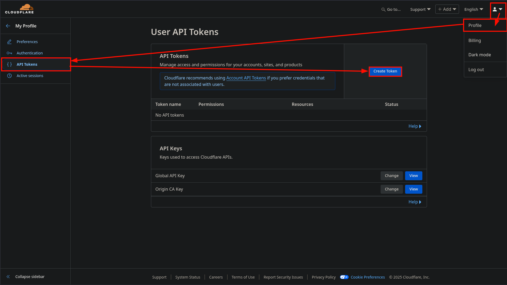
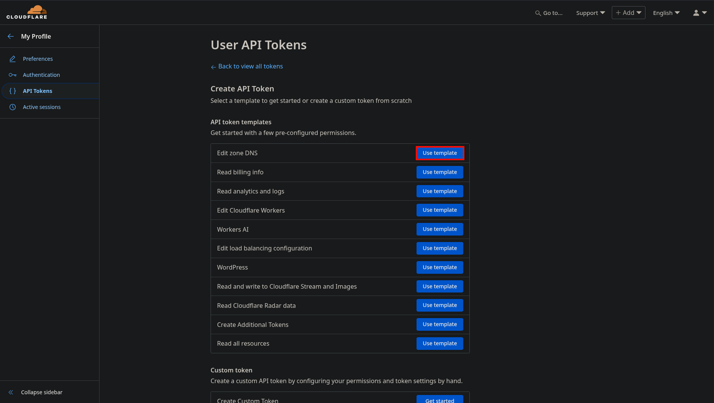
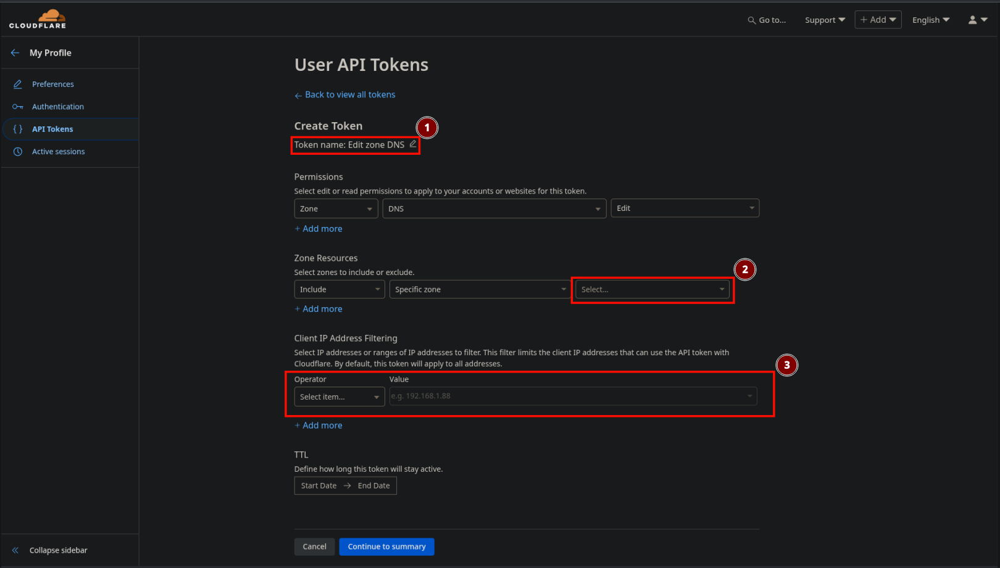

# 6. Cloudflare API Token erstellen

Um die ACME DNS-01 Challenge für die TLS-Zertifikate nutzen zu können, wird ein API Token von Cloudflare benötigt.

Zum Erstellen des API Tokens meldet man sich bei Cloudflare an und befolgt folgende Schritte:

## Navigiere zu "My Profile" und öffne den Reiter "API Tokens"

## Nach dem Klick auf "Create Token" das "Edit zone DNS" Template auswählen

## Token konfigurieren

1. Den Namen für das Token vergeben (Bsp.: Servername eintragen).
2. Die Zone auswählen, für welche der Token gültig sein soll (können auch mehrere sein).
3. Die IP Adressen des Server eintragen, welche den Token verwenden dürfen.
-> Dort bietet sich an einerseits das IPv6 Subnet und andererseits die IPv4 Adresse einzutragen.

