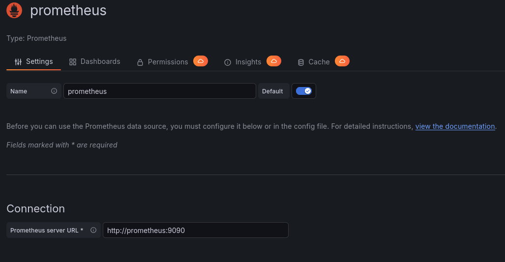

# 4. Monitoring

!!! info ""
    Work in progress - not finished yet!

Als Monitoring verwenden wir den Prometheus Stack ([Prometheus](https://github.com/prometheus/prometheus)
  + [Alertmanager](https://github.com/prometheus/alertmanager)
  + [Pushgateway](https://github.com/prometheus/pushgateway)) mit
  [Grafana](https://grafana.com/) zur Visualisierung.

Zum Erfassen der Sensordaten verwenden wir neben
[node_exporter](https://github.com/prometheus/node_exporter) (generelle Hoststatistiken),
[blackbox_exporter](https://github.com/prometheus/blackbox_exporter) (ICMP & HTTP Tests) und
[cAdvisor](https://github.com/google/cadvisor) (für Docker) auch Anwendungsspezifische Prometheus
Exporter (nginx, mysql, postgresql, ssh, gitlab, grafana, ...). Viele von diesen sind in
[dieser Liste](https://prometheus.io/docs/instrumenting/exporters/#third-party-exporters) zu finden.

Möchte man bereitgestellte Sensordaten einer Anwendung (die sich nicht im Prometheus-Format befinden)
verarbeiten, so kann man auch einen [eigenen Exporter schreiben](https://prometheus.io/docs/instrumenting/writing_exporters/).

```yaml
services:
  grafana:
    image: grafana/grafana
    restart: always
    volumes:
      - "/srv/monitoring/grafana/lib:/var/lib/grafana"
      - "/srv/monitoring/grafana/etc:/etc/grafana"
    environment:
      GF_RENDERING_SERVER_URL: http://renderer:8081/render
      GF_RENDERING_CALLBACK_URL: http://grafana:3000/
    ports:
      - "[::1]:3000:3000"

  renderer:
    image: grafana/grafana-image-renderer:latest
    restart: always
    environment:
      ENABLE_METRICS: 'true'
      RENDERING_MODE: 'clustered'
      RENDERING_CLUSTERING_MODE: 'browser'
      RENDERING_CLUSTERING_MAX_CONCURRENCY: '5'

  prometheus:
    image: prom/prometheus
    restart: always
    volumes:
      - "/srv/monitoring/prometheus/prometheus.yml:/etc/prometheus/prometheus.yml"
      - "/srv/monitoring/prometheus/data:/prometheus"
    ports:
      - "[::1]:9090:9090"

  alertmanager:
    image: prom/alertmanager
    restart: always
    ports:
      - "[::1]:9093:9093"

  pushgateway:
    image: prom/pushgateway
    restart: always
    ports:
      - "[::1]:9091:9091"

  node_exporter:
    image: prom/node-exporter
    restart: always
    volumes:
      - "/proc:/host/proc:ro"
      - "/sys:/host/sys:ro"
      - "/:/rootfs:ro"
    command:
      - "--path.procfs=/host/proc"
      - "--path.sysfs=/host/sys"
      - "--path.rootfs=/rootfs"
      - "--collector.filesystem.ignored-mount-points='^(/rootfs|/host|)/(sys|proc|dev|host|etc)($$|/)'"
#      - "--collector.filesystem.ignored-fs-types='^(sys|proc|auto|cgroup|devpts|ns|au|fuse\.lxc|mqueue)(fs|)$$'"

  blackbox_exporter:
    image: prom/blackbox-exporter
    restart: always
    command: "--config.file=/config/config.yml"
    volumes:
      - "/srv/monitoring/blackbox_exporter/:/config/"

  cadvisor:
    image: gcr.io/cadvisor/cadvisor
    restart: always
    #privileged: true
    #devices:
    #  - "/dev/kmsg:/dev/kmsg"
    volumes:
      - "/:/rootfs:ro"
      - "/var/run:/var/run:ro"
      - "/sys:/sys:ro"
      - "/var/lib/docker:/var/lib/docker:ro"
      - "/cgroup:/cgroup:ro"

```

```yaml
# /srv/monitoring/prometheus/prometheus.yml
global:
  scrape_interval: 30s
  evaluation_interval: 30s

alerting:
  alertmanagers:
  - scheme: http
    static_configs:
    - targets:
      - 'alertmanager:9093'

scrape_configs:
  - job_name: 'prometheus'
    static_configs:
    - targets: ['localhost:9090']

  - job_name: 'blackbox_exporter_http'
    metrics_path: '/probe'
    params:
      module: [http_2xx]
    static_configs:
      - targets:
        - https://www.google.de
    relabel_configs:
      - source_labels: [__address__]
        target_label: __param_target
      - source_labels: [__param_target]
        target_label: instance
      - target_label: __address__
        replacement: blackbox-exporter:9115

  - job_name: 'blackbox_exporter_icmp'
    metrics_path: '/probe'
    params:
      module: [icmp]
    static_configs:
      - targets:
        - google.com
    relabel_configs:
      - source_labels: [__address__]
        target_label: __param_target
      - source_labels: [__param_target]
        target_label: instance
      - target_label: __address__
        replacement: blackbox-exporter:9115

  - job_name: 'blackbox_exporter'
    static_configs:
      - targets:
        - blackbox-exporter:9115

  - job_name: 'node_exporter'
    static_configs:
      - targets:
        - node_exporter:9100

  - job_name: 'cadvisor'
    static_configs:
      - targets:
        - "cadvisor:8080"

  - job_name: pushgateway
    honor_labels: true
    static_configs:
      - targets: ['pushgateway:9091']
```

```yaml
# /srv/monitoring/blackbox_exporter/config.yml
modules:
  http_2xx:
    prober: http
    http:
      preferred_ip_protocol: "ip4"  # defaults to "ip6"
  icmp:
    prober: icmp
    icmp:
      preferred_ip_protocol: "ip4"  # defaults to "ip6"
```


### Ordner kopieren und Ordnerberechtigungen anpassen
```bash
docker compose cp grafana:/var/lib/grafana /srv/monitoring/grafana/lib
docker compose cp grafana:/etc/grafana /srv/monitoring/grafana/etc

sudo chown -R 472 /srv/monitoring/grafana
```


### Reverse Proxy aufsetzen
=== "nginx"
    ```yaml
        ports:
          - "[::1]:8000:8083"
    ```

    ```nginx
    # /etc/nginx/sites-available/monitoring.domain.de
    # https://ssl-config.mozilla.org/#server=nginx&version=1.27.3&config=modern&openssl=3.4.0&ocsp=false&guideline=5.7
    server {
        server_name monitoring.domain.de;
        listen 0.0.0.0:443 ssl http2;
        listen [::]:443 ssl http2;

        ssl_certificate /root/.acme.sh/monitoring.domain.de_ecc/fullchain.cer;
        ssl_certificate_key /root/.acme.sh/monitoring.domain.de_ecc/monitoring.domain.de.key;
        ssl_session_timeout 1d;
        ssl_session_cache shared:MozSSL:10m;  # about 40000 sessions
        ssl_session_tickets off;

        # modern configuration
        ssl_protocols TLSv1.3;
        ssl_prefer_server_ciphers off;

        # HSTS (ngx_http_headers_module is required) (63072000 seconds)
        add_header Strict-Transport-Security "max-age=63072000" always;

        # OCSP stapling
        ssl_stapling on;
        ssl_stapling_verify on;

        location / {
            proxy_pass http://[::1]:3000/;
            proxy_http_version 1.1;
            proxy_set_header Upgrade $http_upgrade;
            proxy_set_header Connection 'upgrade';
            proxy_set_header X-Real-IP $proxy_add_x_forwarded_for;
            proxy_set_header X-Forwarded-For $remote_addr;
            proxy_set_header X-Forwarded-Proto $scheme;
            proxy_set_header Host $host;
            proxy_cache_bypass $http_upgrade;
        }
    }
    ```

=== "Traefik"
    ```yaml
        labels:
          - "traefik.enable=true"
          - "traefik.http.services.srv_monitoring.loadbalancer.server.port=8083"
          - "traefik.http.routers.r_monitoring.rule=Host(`monitoring.domain.de`)"
          - "traefik.http.routers.r_monitoring.entrypoints=websecure"
    ```


Dieser Webendpoint ist der welcher auf jeden Fall benötigt wird um die Daten darzustellen. Prometheus und Alertmanager haben auch eigene Web Interfaces welche man auch noch mit einem Endpoint versehen könnte. Dies ist aber keine Pflicht.


### Erster Login
Der erste Login ist mit den Zugangsdaten `admin:admin` möglich. Danach fragt Grafana nach einem neuen Passwort für den Admin User.


### Erste data source
Über https://monitoring.domain.de/connections/datasources/new kann man eine neue Datenquelle hinzufügen. 
Dadurch dass in dem docker container ein Prometheus Service ist, können wir Prometheus als Datenquelle hinzufügen. Dies geschiet indem ihr Prometheus auswählt.
Den Namen der Datenquelle könnt ihr frei wählen. Als URL brauchen wir hier `http://prometheus:9090`.

Am Ende sollte die Konfiguration wie folgt aussehen:


