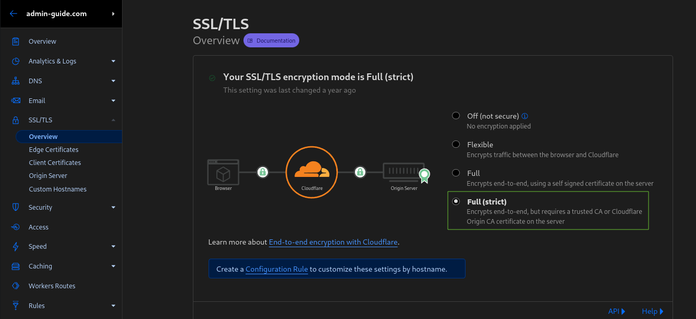
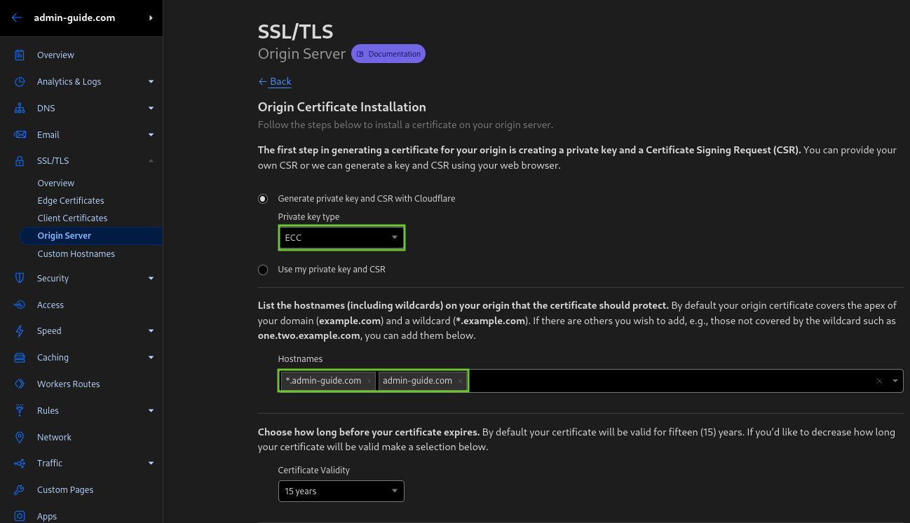
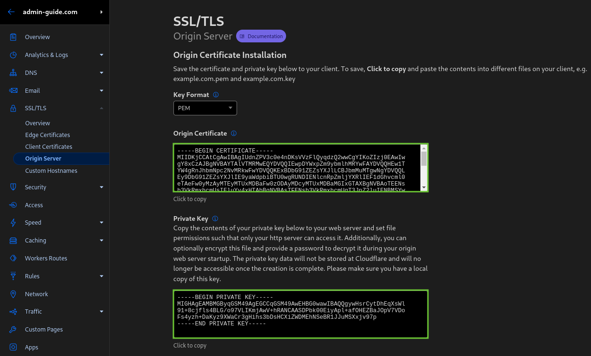

# nginx mit Cloudflare Proxy

Wird der Reverse Proxy nur hinter Cloudflare erreichbar gemacht, können [Origin Server Zertifikat](
https://developers.cloudflare.com/ssl/origin-configuration/origin-ca/) verwendet werden. Diese
werden zwar vom Browser als ungültig angesehen, dies ist aufgrund des vorgeschalteten Cloudflare Proxies
jedoch irrelevant. Da diese Zertifikate von Cloudflare selbst ausgestellt werden, können die TLS Einstellungen 
der Domain dennoch auf "Full (Strict)" gesetzt werden:

{: loading=lazy }

Die Ausstellung der Zertifikate über das Cloudflare Dashboard kann den folgenden Screenshots entnommen werden:
{: loading=lazy }
{: loading=lazy }


Die entstehenden Privaten Schlüssel und Zertifikate werden im Verzeichnis `/etc/ssl/` auf dem Server gespeichert. 

Anschließend wird nginx auf dem Server installiert
```shell
apt install nginx-full
```

## Authenticated Origin Pulls
Um zu verhindern, das direkte Anfragen an den Webserver gestellt werden können (ohne
über Cloudflare Proxy zu gehen) kann der nginx so konfiguriert werden, dass ein mTLS
Zertifikat benötigt wird, welches von der "Cloudflare Origin Pull CA" signiert wurde.
```shell
wget -O /etc/ssl/cloudflare_ca.crt \
    https://developers.cloudflare.com/ssl/static/authenticated_origin_pull_ca.pem
```

In jedem nginx Virtual-Host müssen dafür folgende Zeilen zum Server Block hinzugefügt werden:
```nginx
server {
    # ...
    
    # only allow cloudflare to connect to your nginx
    ssl_client_certificate /etc/ssl/cloudflare_ca.crt;
    ssl_verify_client on;

    # ...
}
```

Die [Einrichtung bei Cloudflare ist in deren Dokumentation](https://developers.cloudflare.com/ssl/origin-
configuration/authenticated-origin-pull/set-up) beschreiben:
{: loading=lazy }

## IPv6 Adresse pro Virtual-Host
Sofern geplant ist, jedem Virtual Host eine eigene IPv6 Adresse zu geben empfielt sich
den nginx systemd-Service um einige Sekunden zu verzögern, sodass sichergestellt werden 
kann, dass das System die IPv6 Adressen der Netzwerkschnittstelle bereits hinzugefügt hat.
Dieses Verfahren wurde auch [hier](https://docs.ispsystem.com/ispmanager-business/troubleshooting-guide/if-nginx-does-not-start-after-rebooting-the-server) beschrieben.

{: loading=lazy }

Dazu muss in der Datei `/lib/systemd/system/nginx.service` vor der ersten `ExecStartPre` Zeile folgendes hinzugefügt werden:
```shell
# make sure the additional ipv6 addresses (which have been added with post-up) 
# are already on the interface (only required for enabled nginx service on system boot)
ExecStartPre=/bin/sleep 5
```

### Konfiguration für neue Dienste

Folgende Schritte sind notwendig, um ein neues HTTP Routing zu konfigurieren:
1. Dienst aufsetzen.
2. Port-Binding von Dienst auf IPv6 Localhost (`::1`) des Hosts.
3. Optional: Sofern für die gewünschte Domain noch kein Zertifikat existiert, dieses Ausstellen.
4. Optional: Eigene IPv6 Adresse für Virtual Host konfigurieren.
5. nginx Virtual-Host konfigurieren und aktivieren.
6. Konfiguration testen und nginx neu laden.

#### Dienst aufsetzen
...

#### Port-Binding von Dienst auf IPv6 Localhost (`::1`) des Hosts
Die Containerdefinition muss ein entsprechenden Eintrag erhalten, sodass der Port 
auf dem der Container den Dienst bereitstellt auf dem Hostsystem lokal verfügbar ist.
Dabei darf natürlich nur die linke Seite (hier 8081) verändert werden.
```yaml
    ports:
      - "[::1]:8081:80"
```

#### Optional: Sofern für die gewünschte Domain noch kein Zertifikat existiert, dieses Ausstellen.
siehe oben!

#### Optional: Eigene IPv6 Adresse für Virtual Host konfigurieren
Sofern eine eigene IPv6 Adresse für diesen Dienst verwendet werden soll,
wird diese der entsprechenden Netzwerkschnittstelle hinzugefügt, sodass 
diese in nginx verwendet werden kann. 

```shell
# /etc/network/interfaces

# ...

iface eth0 inet6 static
    # ipv6 address of the host
    address 2001:db8:1234:5678::1/64
    gateway 2001:db8::1
    # service.domain.de
    post-up ip -6 a add 2001:db8:1234:5678:5eca:dc9d:fd4e:6564/64 dev eth0
```

#### nginx Virtual-Host konfigurieren und aktivieren
Anschließend wird die Virtual Host Konfiguration unter dem Pfad
`/etc/nginx/sites-available/domain` angelegt. Dabei müssen hauptsächlich die 
mit Pfeil markierten Zeilen beachtet werden.
```nginx
# https://ssl-config.mozilla.org/#server=nginx&version=1.17.7&config=modern&openssl=1.1.1d&guideline=5.6
server {
    server_name service.domain.de;               # <---
    listen [::]:443 ssl http2;                   # <---

    ssl_certificate /etc/ssl/domain.de.pem;
    ssl_certificate_key /etc/ssl/domain.de.key;
    ssl_session_timeout 1d;
    ssl_session_cache shared:MozSSL:10m;  # about 40000 sessions
    ssl_session_tickets off;

    # modern configuration
    ssl_protocols TLSv1.3;
    ssl_prefer_server_ciphers off;

    # HSTS (ngx_http_headers_module is required) (63072000 seconds)
    add_header Strict-Transport-Security "max-age=63072000" always;

    # only allow cloudflare to connect to your nginx
    ssl_client_certificate /etc/ssl/cloudflare_ca.crt;
    ssl_verify_client on;

    location / {
        proxy_pass http://[::1]:8081/;           # <---
        proxy_http_version 1.1;
        proxy_set_header Upgrade $http_upgrade;
        proxy_set_header Connection 'upgrade';
        proxy_set_header X-Real-IP $proxy_add_x_forwarded_for;
        proxy_set_header X-Forwarded-For $proxy_add_x_forwarded_for;
        proxy_set_header X-Forwarded-Proto $scheme;
        proxy_set_header X-Forwarded-SSL on;
        proxy_set_header Host $host;
        proxy_cache_bypass $http_upgrade;
    }
}
```

#### Konfiguration aktivieren, testen und anwenden.
Nun muss noch der Link zu `/etc/nginx/sites-enabled/` angelegt werden, 
bevor die Konfiguration von nginx getestet werden kann und anschließend
nginx neu geladen werden kann, sofern der Test keine Fehler ergeben hat:
```shell
ln -s /etc/nginx/sites-available/service.domain.de \
    /etc/nginx/sites-enabled/

nginx -t && systemctl reload nginx
```
