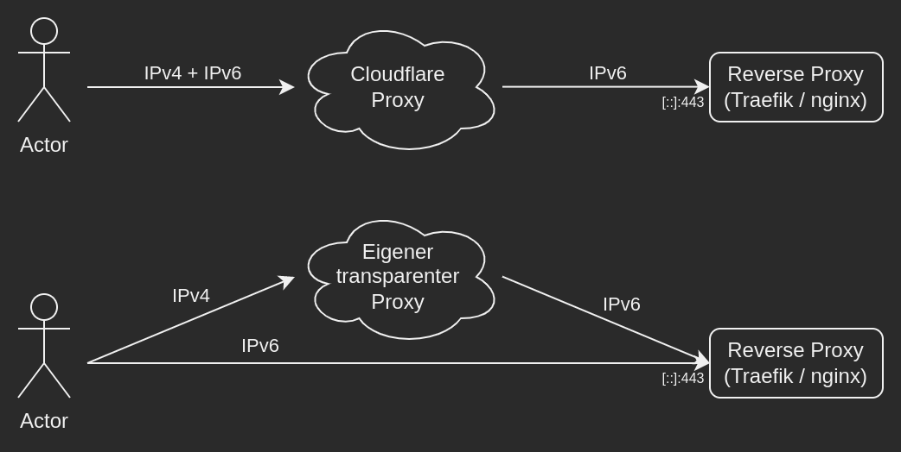

# Startseite

Diese Informationssammlung beschreibt das von mir bevorzugte Verfahren zum 
Aufsetzen eines Linux Servers mit Anwendungen in Docker Containern. Hauptsächlich 
handelt es sich in meinem Fall um webbasierte Anwendungen. Diese werden nur über 
IPv6 mit einem Reverse Proxy ([Traefik](https://traefik.io/) als Docker Container, 
oder [`nginx`](https://www.nginx.com/) auf dem Host) erreichbar gemacht. Um die 
IPv4 Erreichbarkeit zu gewährleisten wird entweder Cloudflare Proxy (mit TLS 
Termination) oder ein eigener (transparenter) Proxy verwendet.

## Vor und Nachteile von Cloudflare Proxy

Die Vorteile von Cloudflare Proxy sind neben des DDoS Schutzes, die Möglichkeit [Web 
Application Firewall](https://developers.cloudflare.com/waf/managed-rules/) / [Page 
Rules](https://www.cloudflare.com/features-page-rules/) auf die eingehenden Anfragen
anzuwenden. Als Nachteil ist hier anzuführen, dass der Datenverkehr der Nutzer bei 
Cloudflare entschlüsselt wird.

{: loading=lazy }

### Nutzern das direkte Verbinden zum Server verbieten

Wird Cloudflare verwendet, möchte man meist sicherstellen, dass sich niemand direkt 
mit dem Server verbinden kann, wodurch die Firewall Regeln umgangen werden könnten. 
Dazu kann der Reverse Proxy so konfiguriert werden, dass jede Anfrage ein TLS Client 
(mTLS) Zertifikat von der "Cloudflare Origin Pull CA" übermitteln muss. Die [Einrichtung 
bei Cloudflare ist in deren Dokumentation](https://developers.cloudflare.com/ssl/origin-
configuration/authenticated-origin-pull/set-up) beschreiben.

## Lokales HTTP Routing

Nachdem die Anfragen den Reverse Proxy auf unserem eigenen Host erreicht haben, werden 
diese je nach verwendetem Reverse Proxy über lokal gebundene Ports oder Docker Labels
an den Container weitergeleitet, der den Dienst bereitstellt.

## Verzeichnisstruktur

Jeder bereitgestellte Dienst erhält zwei Verzeichnisse:  
1. Im Verzeichnis `/home/admin/<service>` liegt die Containerdefinition (`docker-compose.yml`),  
2. die Daten des Dienstes werden im Verzeichnis `/srv/<service>` gespeichert.

### Umgebungsvariablen

Schützenswerte Umgebungsvariablen (Passwörter, API Tokens, ...) werden nicht in der 
Containerdefinition abgelegt, sondern in einer separaten `env`-Datei, um die Gefahr einer 
Offenlegung dieser (z. B. beim Teilen des Bildschirms) zu reduzieren. Diese tragen den 
Container-Namen des Dienstes im docker-compose Kontext.

Im folgenden Beispiel-Dienst (`service: example`, `service_name: example_srv`) würde die 
`env`-Datei unter dem Pfad `/home/admin/example/.example_srv.env` angelegt werden.
```yaml
# /home/admin/example/docker-compose.yml
services:
  example_srv:
    image: ...
    env_file: .example_srv.env
```

### Reverse Proxy

TODO: Hier text einfügen welche Vor-/Nachteile nginx/Traefik bieten:

* nginx: höherer Konfigurationsaufwand durch statische vhost config.
* Traefik: braucht für dynamische Konfiguration über gesettzte Docker Labels Zugriff auf Docker Daemon.

* für Traefik muss ja auch noch was zu den TLS Zertifkaten gesagt werden, daher evtl Alternative aus NGINX block rausziehen und nur darauf referenzieren.

=== "Traefik"
    Da Traefik als Docker Container bereitgestellt wird, gilt die oben genannte Verzeichnisstruktur:

    * Containerdefinition: `/home/admin/traefik/docker-compose.yml`  
    * Env-Vars (hier DNS API Token): `/home/admin/traefik/.traefik.env`  
    * Daten (z.B. TLS Zertifikate): `/srv/traefik`  
=== "nginx"
    Da `nginx` nicht als Docker Container bereitgestellt wird, sondern direkt auf dem Host 
    installiert wird, gilt hier eine andere Verzeichnisstruktur.

    Die "Virtual-Host" Konfigurationsdateien liegen im Verzeichnis `/etc/nginx/sites-available/`
    unter der Domain, die Sie erreichbar machen.

    Die dazu notwendigen TLS Zertifikate liegen je nach verwendetem Proxy, der die IPv4 
    Erreichbarkeit sicherstellt, in unterschiedlichen Verzeichnissen.

    === "Cloudflare Proxy"
        Wird Cloudflare verwendet, so wird für jede genutzte Domain ein Wildcard [Origin Server Zertifikat]
        (https://developers.cloudflare.com/ssl/origin-configuration/origin-ca/) ausgestellt. Dieses
        wird zwar vom Browser als ungültig markiert, da Cloudflare dieses jedoch als gültig ansieht,
        und der Cloudflare Proxy vorgeschaltet wird, ist dies im weiteren Verlauf irrelevant. Das 
        Zertifikat liegt zusammen mit dem Private Key und dem [Cloudflare Origin Pull CA Zertifikat](
        https://developers.cloudflare.com/ssl/static/authenticated_origin_pull_ca.pem) im Verzeichnis `/etc/ssl/`.
    === "eigener transparenter Proxy"
        Wird der eigene transparente Proxy verwendet, so muss das Zertifikat im Browser als valide angesehen werden,
        da sich Anwender, die über eine IPv6 Adresse verfügen, direkt mit dem Server verbinden. Zum Ausstellen dieser
        wird Let's Encrypt mit `acme.sh` verwendet. Prinzipiell ist die genutzte [ACME Challenge](
        https://letsencrypt.org/docs/challenge-types/) irrelevant. Da ich auch interne Dienste betreibe, die 
        aus dem Internet nicht erreichbar sind verwende ich prinzipiell die ACME-DNS-01 Challenge.
        `acme.sh` läuft Unterhalb des `root`-Nutzers, wodurch die Private Keys und Zertifikate in 
        `/root/.acme.sh/<domain>/...` liegen.

