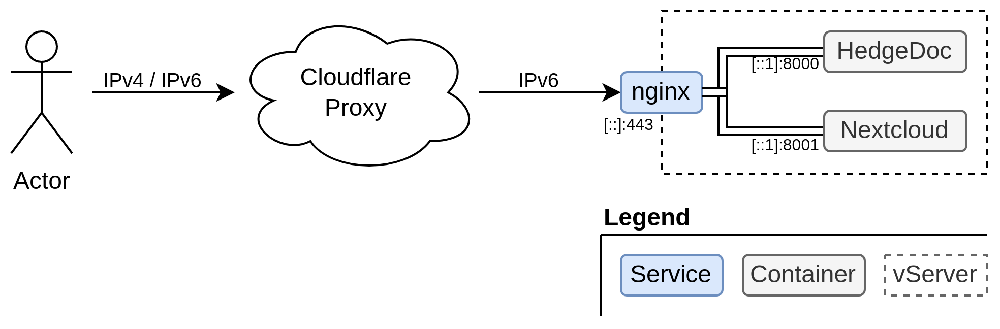

# Introduction

This guide describes my current preferred method to make a services accessible behind Cloudflare proxy.

Basically, I only make web-based applications available via IPv6. To ensure IPv4 reachability, and to be able to use
a web application firewall or page rules if necessary, the Cloudflare proxy is used.

To ensure that the WAF / Page Rules cannot be bypassed, my web server expects a mTLS client certificate from the
Cloudflare Origin Pull CA, the setup for Cloudflare is described [here](https://developers.cloudflare.com/ssl/origin-configuration/authenticated-origin-pull/set-up).

All https requests from Cloudflare go to an `nginx` which acts as a reverse proxy on the host.
From there, the requests will be passed to the docker container, which is responsible for the service.

{: loading=lazy }

## Structure

Every service has its own directory in `/home/admin/<service>` and `/srv/<service>`.

Services which are accessible over the web (https) have:

* an nginx vhost in `/etc/nginx/sites-available/<domain>`,
* a tls certificate in `/etc/ssl/<domain>.crt`, and
* a private key in `/etc/ssl/<domain>.key`

`/home/admin/<service>/.<service_name>.env` contains the environment variables needed for the service.
This helps to prevent leaks, for example while sharing the screen. Be aware that these two service identifier can differ
(e.g. in the matrix service where the `service` is `matrix`, but the `service_name` is `synapse`).
