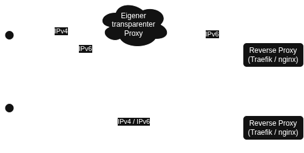

# Startseite

Diese Informationssammlung beschreibt das von mir eingesetzten Verfahren zum 
Aufsetzen eines Linux Servers mit Anwendungen in Docker Containern. Hauptsächlich 
handelt es sich in meinem Fall um webbasierte Anwendungen. Diese werden mit einem 
Reverse Proxy ([Traefik](https://traefik.io/) als Docker Container, oder 
[nginx](https://www.nginx.com/) auf dem Host) erreichbar gemacht.

Prinzipiell unterschiede ich im weiteren zwischen der Anzahl an Systemen,
die ein Projekt aufweißt.

Handelt es sich bei dem System um einen einzelnen kleinen Cloudserver bei einem 
Hoster, kann der eingesetzte Reverse Proxy über IPv4 und IPv6 Verfügbar gemacht 
werden.

Sofern mehrere Server verwendet werden, sind die Reverse Proxies nur über 
IPv6 erreichbar. Um die IPv4 Erreichbarkeit zu gewährleisten wird entweder 
Cloudflare Proxy (mit TLS Terminierung) oder ein eigener (transparenter) Proxy 
verwendet.

{: loading=lazy }


## Lokales HTTP Routing

Nachdem die Anfragen den Reverse Proxy auf unserem eigenen Host erreicht haben, werden 
diese je nach verwendetem Reverse Proxy über lokal gebundene Ports oder Docker Labels
an den Container weitergeleitet, der den Dienst bereitstellt.

## Verzeichnisstruktur

Jeder bereitgestellte Dienst erhält zwei Verzeichnisse:  
1. Im Verzeichnis `/home/admin/<service>` liegt die Containerdefinition (`docker-compose.yml`),  
2. die Daten des Dienstes werden im Verzeichnis `/srv/<service>` gespeichert.

### Umgebungsvariablen

Schützenswerte Umgebungsvariablen (Passwörter, API Tokens, ...) werden nicht in der 
Containerdefinition abgelegt, sondern in einer separaten `env`-Datei, um die Gefahr einer 
Offenlegung dieser (z. B. beim Teilen des Bildschirms) zu reduzieren. Diese werden entsprechend 
des Container-Namen im docker-compose Kontext benannt.

Im folgenden Beispiel-Dienst (`service: example`, `service_name: example_srv`) würde die 
`env`-Datei unter dem Pfad `/home/admin/example/.example_srv.env` angelegt werden.
```yaml
# /home/admin/example/docker-compose.yml
services:
  example_srv:
    image: ...
    env_file: .example_srv.env
```
