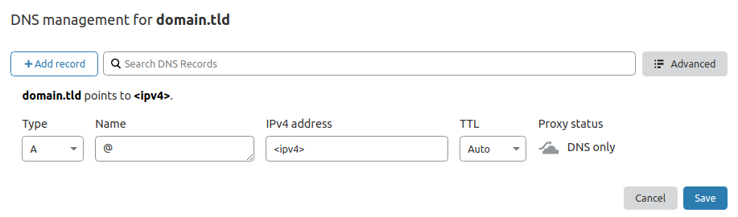
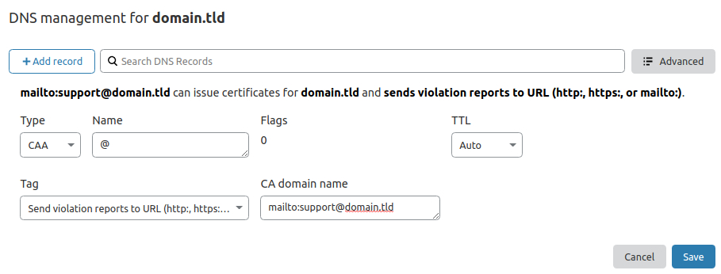

## Required DNS entries

```bash
# ridirect yout domain to IPv4
@ A <ipv4>

# ridirect yout domain to IPv6 (optional)
@ AAAA <ipv6>

# redirect all subdomain to IPv4
* A <ipv4>

# redirect all subdomain to IPv6 (optional)
* AAAA <ipv6>

# redirect some subdomains to other IPv4 (optional)
<subdomain> A <ipv4>

# redirect some subdomains to other IPv6 (optional)
<subdomain> AAAA <ipv4>

# allow letsencrypt.org to issue certificates for your domain
@ CAA 0 issue "letsencrypt.org"

# allow letsencrypt.org to also issue wildcard certificates for your domain
@ CAA 0 issuewild "letsencrypt.org"

# set email address for certificate misuse
@ CAA 0 iodef "mailto:monitoring@domain.tld"
```

## Cloudflare Name Servers

It is recommended to change the name servers of your domain to the Cloudflare name servers.
Check out [this (support.cloudflare.com)](https://support.cloudflare.com/hc/en-us/articles/205195708-Changing-your-domain-nameservers-to-Cloudflare) tutorial for your provider.

### Examples records for the Cloudflare DNS management:

{: loading=lazy }
{: loading=lazy }

## Configure reverse DNS

The reverse DNS is used to obtain the domain attached to an IP address.
You can do this in the server control panel.

## Validate DNS updates

!!! note ""
    DNS Updates can take quiet some time!

<details>
  <summary>Check IPv4 DNS entries</summary>

```
$ dig A <domain> @1.1.1.1

; <<>> DiG 9.16.1-Ubuntu <<>> A domain.tld @1.1.1.1
;; global options: +cmd
;; Got answer:
;; ->>HEADER<<- opcode: QUERY, status: NOERROR, id: 55520
;; flags: qr rd ra ad; QUERY: 1, ANSWER: 1, AUTHORITY: 0, ADDITIONAL: 1

;; OPT PSEUDOSECTION:
; EDNS: version: 0, flags:; udp: 1232
;; QUESTION SECTION:
;domain.tld.                     IN      A

;; ANSWER SECTION:
domain.tld.              300     IN      A       <ipv4 of your server>

;; Query time: 60 msec
;; SERVER: 1.1.1.1#53(1.1.1.1)
;; WHEN: Thu Nov 05 21:43:35 CET 2020
;; MSG SIZE  rcvd: 54
```

</details>

<details>
  <summary>Check wildcard DNS entries</summary>

```
$ dig A nonexisting.<domain> @1.1.1.1

; <<>> DiG 9.16.1-Ubuntu <<>> A nonexisting.domain.tld @1.1.1.1
;; global options: +cmd
;; Got answer:
;; ->>HEADER<<- opcode: QUERY, status: NOERROR, id: 49020
;; flags: qr rd ra ad; QUERY: 1, ANSWER: 1, AUTHORITY: 0, ADDITIONAL: 1

;; OPT PSEUDOSECTION:
; EDNS: version: 0, flags:; udp: 1232
;; QUESTION SECTION:
;nonexisting.domain.tld.          IN      A

;; ANSWER SECTION:
nonexisting.domain.tld.   295     IN      A       <ipv4 of your server>

;; Query time: 30 msec
;; SERVER: 1.1.1.1#53(1.1.1.1)
;; WHEN: Thu Nov 05 21:48:11 CET 2020
;; MSG SIZE  rcvd: 65
```

</details>

<details>
  <summary>Check CAA DNS entries</summary>

```
$ dig CAA <domain> @1.1.1.1

; <<>> DiG 9.16.1-Ubuntu <<>> CAA domain.tld @1.1.1.1
;; global options: +cmd
;; Got answer:
;; ->>HEADER<<- opcode: QUERY, status: NOERROR, id: 22461
;; flags: qr rd ra ad; QUERY: 1, ANSWER: 7, AUTHORITY: 0, ADDITIONAL: 1

;; OPT PSEUDOSECTION:
; EDNS: version: 0, flags:; udp: 1232
;; QUESTION SECTION:
;domain.tld.                     IN      CAA

;; ANSWER SECTION:
domain.tld.              300     IN      CAA     0 iodef "mailto:monitoring@domain.tld"
domain.tld.              300     IN      CAA     0 issue "letsencrypt.org"
domain.tld.              300     IN      CAA     0 issuewild "letsencrypt.org"

;; Query time: 30 msec
;; SERVER: 1.1.1.1#53(1.1.1.1)
;; WHEN: Thu Nov 05 21:45:38 CET 2020
;; MSG SIZE  rcvd: 283
```

</details>

<details>
  <summary>Check reverse DNS</summary>

```bash
$ nslookup <ip>
reversed-ip.in-addr.arpa       name = domain.tld.

Authoritative answers can be found from:
```

</details>
