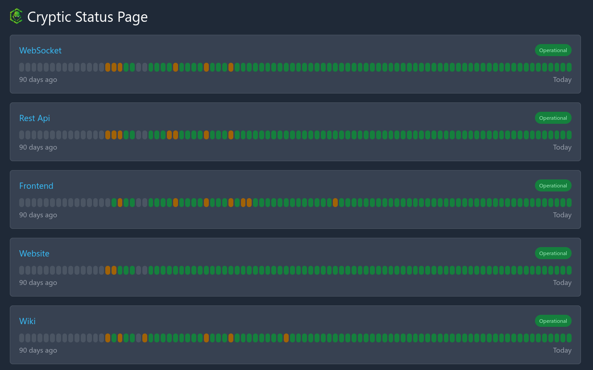

# Status Page

Eine Statusseite, sollte unabhängig von der zu überwachenden Infrastruktur gehostet werden.
Mithilfe von Cloudflare Worker & Cloudflare Pages kann dieser Service kostenfrei dort gehostet werden.

[{: loading=lazy }](https://status.cryptic-game.net)

## Installation

Zunächst müssen die beiden Repositories 
[github.com/themorpheustutorials/status](https://github.com/themorpheustutorials/status) und
[github.com/themorpheustutorials/status-web](https://github.com/themorpheustutorials/status-web) 
geforked werden.

### Backend: status Repository

Um das Backend Repository in Cloudflare Worker deployen zu können, muss zunächst 
ein API Token mit den Berechtigungen für die Verwaltung von CF Workers erstellt 
werden. Dieser API Token wird im Github Repository als `CF_API_TOKEN` Secret 
angelegt. Desweiteren wird ein neuer KV Store im Cloudflare Worker Webinterface 
mit dem Namen `STATUS` erstellt. Die Account und KV Store ID wird in die 
`wranger.toml` gespeichert.

Nun muss die Liste von Namespaces und zu überwachenden Services in 
der Datei `src/index.ts` angepasst werden.

### Frontend: status-web Repository
Zunächst wird die API URL des Backend Workers in der Datei 
`src/environment/environment.prod.ts` eingetragen.

Anschließend kann das Favicon in `src/favicon.ico` angepasst werden und in der Datei
`src/app/app.component.ts` der Inhalt der Funktionen `ngOnInit` und `getBrand` entfernt werden.

In die `ngOnInit` Funktion muss der folgende Aufruf hinzugefügt werden
```js
this.apiService.loadData('<your namespace id>');
```


Zuletzt muss in Cloudflare Pages das Repository deployed werden. 
Als Build Command wird `npm run build:ci -- --output-path=./dist` gesetzt, 
als Build Output Directory `dist`

{: loading=lazy }
