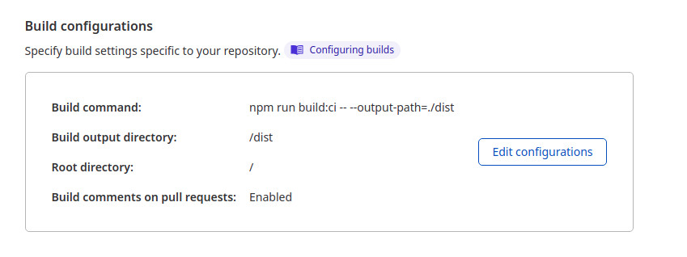

# Element

!!! warning "Security Note"
    For security reasons, it is recommended that element is not used by the same domain as the Matrix homeserver. For more information see [here](https://github.com/vector-im/element-web#separate-domains)

## Cloudflare Pages

Fork [github.com/vector-im/element-web](https://github.com/vector-im/element-web) and change the `config.json` according
to your matrix server details.

If you want to add a `_redirects` file to configure http redirects, you have to add the redirects file in the copy file
section in the `scripts/copy-res.js` file.

Now you can create a new page in the Cloudflare Pages webinterface with the following options:

| Name                   | Value        |
|------------------------|--------------|
| Build Command          | `yarn build` |
| Build output directory | `webapp`     |

{: loading=lazy }
