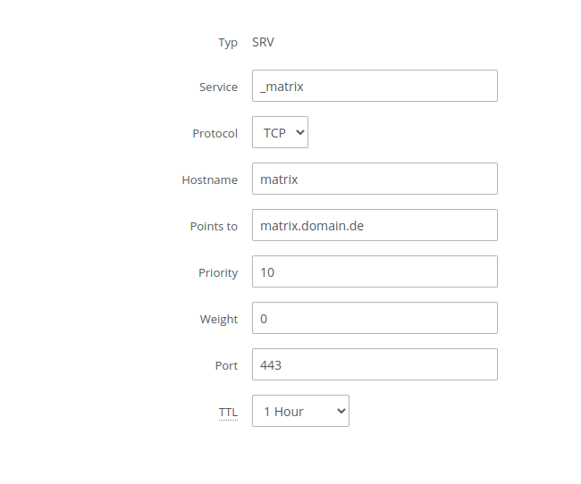

# Matrix

```yaml
version: '3.9'

services:
  postgres:
    image: postgres
    restart: always
    env_file: .postgres.env
    volumes:
      - "/srv/matrix/postgres:/var/lib/postgresql/data"

  synapse:
    image: matrixdotorg/synapse
    restart: always
    volumes:
      - "/srv/matrix/synapse:/data"
    ports:
      - "[::1]:8000:8008"

#  mautrix-signal:
#    image: dock.mau.dev/mautrix/signal
#    restart: always
#    depends_on:
#      - "signald"
#    volumes:
#      - "/srv/mautrix-signal:/data:Z"
#      - "/srv/signald:/signald/:z"
#
#  signald:
#    image: docker.io/signald/signald
#    restart: always
#    volumes: 
#      - "/srv/signald:/signald:z"

#  mautrix-telegram:
#    image: dock.mau.dev/mautrix/telegram
#    restart: always
#    volumes:
#      - "/srv/comms/mautrix-telegram:/data:Z"

#  mautrix-whatsapp:
#    image: dock.mau.dev/mautrix/whatsapp
#    restart: always
#    volumes:
#      - "/srv/matrix/mautrix-whatsapp:/data:Z"
#      - "/etc/timezone:/etc/timezone:ro"
```

```shell
# .postgres.env
POSTGRES_HOST_AUTH_METHOD=trust
POSTGRES_DB=synapse
POSTGRES_INITDB_ARGS=-E UTF8 --lc-collate=C --lc-ctype=C
```

Before starting this container you need to generate a configuration file. 
This command generates a `homeserver.yaml` configuration file under `/srv/matrix`
```yaml
docker run -it --rm -v "/srv/matrix/synapse:/data" -e "SYNAPSE_SERVER_NAME=matrix.domain.de" -e "SYNAPSE_REPORT_STATS=no" matrixdotorg/synapse generate
```

Afterwards you should configure the postgresql database:
```yaml
database:
  name: psycopg2
  args:
    user: postgres
    password: irrelevant
    database: synapse
    host: postgres
    cp_min: 5
    cp_max: 10
```

Don't forget to uncomment the sqlite database which is used by default:
``` yaml
#database:
# name: sqlite3
# args:
# database: /data/homeserver.db
```

Now you can start the service using `docker-compose up -d matrix`.

If you don't want to use OpenID Connect (e.g. with Keycloak), you may now create users:
```yaml
docker-compose exec synapse register_new_matrix_user -u USERNAME -p PASSWORD -a -c /data/homeserver.yaml https://matrix.domain.de
```

### Reset password of user 

If you want to reset the password run 
```shell
docker-compose exec -u www-data synapse hash_password -p PASSWORD
```

After the command is done you will get a password hash as stdout. 

Once you have generated the password hash you can update the value in the database. First start a shell in the postgres container with. 
```shell
docker-compose exec postgres /bin/bash
```
Next, you can update the password with the command 
```shell
PGPASSWORD=S3cr3T \
  psql -U postgres -d synapse -c \
  "UPDATE users SET password_hash='\$2a\$12$xxxxxxxxxxxxxxxxxxxxxxxxxxxxxxx' \
  WHERE name='@test:test.com';"
```

### Federation 

!!! info ""
	Even though you can use a srv dns record to do this, we suggest taking a look 
	at [hosting your .well-known in cloudflare workers](well-known.md). 

```
;; SRV Records
_matrix._tcp.matrix.domain.de.    1    IN    SRV    10 5 443 matrix.domain.de.
```

{: loading=lazy }

### SSO with Keycloak

If you have an Instance of *Keycloak* running, you can use it as an external Authentication Provider.
At first, we have to create the Client in Keycloak. Create a new Client. Use `matrix.domain.de` as Client ID
and `openid` as Protocol. Edit your newly created Client as follows:

| Setting                      | Value                                                  |
|------------------------------|--------------------------------------------------------|
| Access Type                  | confidential                                           |
| Direct Access Grants Enabled | OFF                                                    |
| Root URL                     | `https://matrix.domain.de`                             |
| Valid Redirect URIs          | `https://matrix.domain.de`   `http://matrix.domain.de` |
| Base URL                     | `https://matrix.domain.de`                             |
| Web Origins                  | +                                                      |

Now go to the "Credentials" Tab and save the Client Secret; we will need it later.


Now we have to edit the `homeserver.yaml` file. I suggest you search for the Values because the file is very long.
Uncomment / add and edit the following lines:

```
server_name: "matrix.domain.de"

enable_registration: false
password_config.enabled: false

oidc_providers:
# Keycloak
  - idp_id: keycloak
    idp_name: YOURNAME
    issuer: "https://id.domain.de/realms/main"
    client_id: "matrix.domain.de"
    client_secret: "YOURSECRET"
    scopes: ["profile"]
```

**It is very important to remove the `openid` Scope which is preset. Things will not work if the
`openid` Scope is set.**

Now restart your Matrix Server. You should now be able to log in with your Keycloak as an SSO Provider.

### Bridge Setup
For the bridge setup simply follow the instructions at the [docs](https://docs.mau.fi/bridges/python/signal/setup-docker.html)