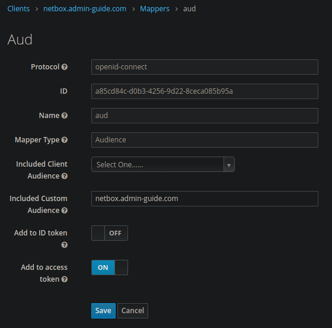
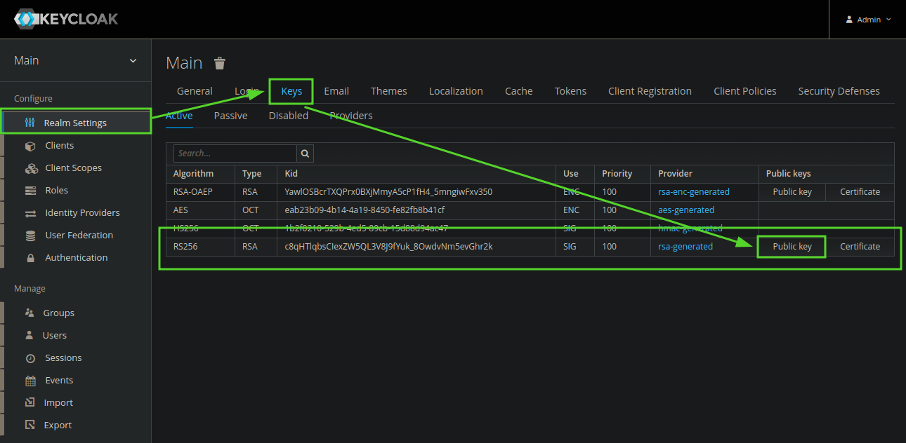

# NetBox

NetBox ist eine Open-Source-Software zur Verwaltung von Netzwerkinfrastrukturen. Es bietet eine
zentrale Plattform zur Dokumentation, Verfolgung und Planung von Hardware, IP-Adressen, Kabelverbindungen und anderen
Ressourcen in komplexen IT-Umgebungen.

```shell
apt install -y git

git clone -b release https://github.com/netbox-community/netbox-docker.git /home/admin/netbox

# hostname of netbox is shown on the website, so it should be overwritten
# also the default configuration is using docker volumes, which I don't like, so let's overwrite them
cat <<_EOF > /home/admin/netbox/docker-compose.override.yml
version: '3.4'

services:
  netbox:
    hostname: netbox.domain.de
    ports:
      - "[::1]:8000:8080"

  postgres:
    volumes:
      - "/srv/netbox/postgres:/var/lib/postgresql/data"

  redis:
    volumes:
      - "/srv/netbox/redis:/data"
_EOF

# I also don't like it, that the netbox environment variables contain passwords for
# the database and redis so let's change them (redis) and enable trust auth for postgres
cat <<_EOF > /home/admin/netbox/env/postgres.env
POSTGRES_DB=netbox
POSTGRES_HOST_AUTH_METHOD=trust
POSTGRES_USER=netbox
_EOF

cat <<_EOF > /home/admin/netbox/env/redis.env
REDIS_PASSWORD=$(cat /dev/urandom | tr -dc A-Za-z0-9 | fold -w32 | head -n1)
_EOF

# load the redis password into the environment variables, to be able to print it out in the next step.
source /home/admin/netbox/env/redis.env

# NetBox also put's in a default SECRET_KEY, which is used by django to make sessions.
# If you don't change this an authentication bypass might be possible!!!
# We also set another superuser password, please change it right after the first login.
cat <<_EOF > /home/admin/netbox/env/netbox.env
DB_PASSWORD=irrelevant
REDIS_PASSWORD=${REDIS_PASSWORD}
LOGIN_REQUIRED=true
TIME_ZONE=Europe/Berlin
SECRET_KEY=$(cat /dev/urandom | tr -dc A-Za-z0-9 | fold -w32 | head -n1)
SUPERUSER_PASSWORD=AdminGuide!
_EOF
```

Nach diesem Schritt kannst du dich einloggen mit `admin` / `AdminGuide!`.

## E-Mail

`/home/admin/netbox/env/netbox.env`:
```env
EMAIL_FROM=noreply@domain.de
EMAIL_PASSWORD=S3cr3T
EMAIL_PORT=587
EMAIL_SERVER=mail.domain.de
EMAIL_SSL_CERTFILE=
EMAIL_SSL_KEYFILE=
EMAIL_TIMEOUT=5
EMAIL_USERNAME=noreply@domain.de
# EMAIL_USE_SSL and EMAIL_USE_TLS are mutually exclusive, i.e. they can't both be `true`!
EMAIL_USE_SSL=true
EMAIL_USE_TLS=false
```

## OpenID Connect / Keycloak

Ändere `User Info Signed Response Algorithm` und `Request Object Signature Algorithm` in dem Keycloak Client (in der
Kategorie: Fine Grain OpenID Connect Configuration) to RS256.

Erstelle nun ein Mapper in dem erstelltem Keycloak client:

{: loading=lazy }

Erweitere `/home/admin/netbox/env/netbox.env`:
```env
REMOTE_AUTH_BACKEND='social_core.backends.keycloak.KeycloakOAuth2'
```

Erweitere auch `/home/admin/netbox/configuration/configuration.py`:
```py
## OIDC Keycloak Configuration
SOCIAL_AUTH_KEYCLOAK_ID_KEY = 'preferred_username'
SOCIAL_AUTH_KEYCLOAK_KEY = '<client id>'
SOCIAL_AUTH_KEYCLOAK_SECRET = '<client secret>'
SOCIAL_AUTH_KEYCLOAK_PUBLIC_KEY = \
  '<public key>'
SOCIAL_AUTH_KEYCLOAK_AUTHORIZATION_URL = \
  'https://id.domain.de/realms/main/protocol/openid-connect/auth'
SOCIAL_AUTH_KEYCLOAK_ACCESS_TOKEN_URL = \
  'https://id.domain.de/realms/main/protocol/openid-connect/token'
```

Der Public Key kann in den Keycloak Realm Einstellungen ausgelesen werden:
{: loading=lazy }

## Netbox Contextmenues
Wir empfehlen dieses GitHub Repo: [contextmenu addon](https://github.com/PieterL75/netbox_contextmenus/).
