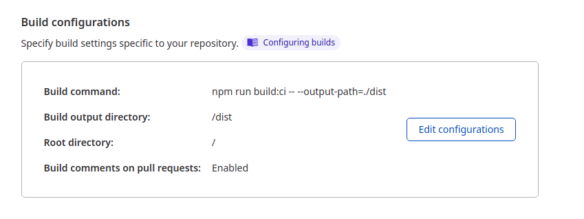

!!! info ""
    If you want to deploy a status page it is important to deploy the status infrastructure independent to the main infrastructure. For this reason we are deploying the staus page on Cloudflare Pages and Workers. Cloudflare Pages is being used for the frontend and Workers for the backend.

## Examples

* [Cryptic Staus Page](https://status.cryptic-game.net)

[{: loading=lazy }](https://status.cryptic-game.net)

## Installation

1. Fork the following two repos:

    * [github.com/themorpheustutorials/status](https://github.com/themorpheustutorials/status)
    * [github.com/themorpheustutorials/status-web](https://github.com/themorpheustutorials/status-web)

---
**repo: status**
 
2. Create an Api token in the Cloudflate Account Settings and grant it access to Workers in the specific account. 
3. Create a GitHub Secret with the Api token: `CF_API_TOKEN` 
4. Change the list of services and namespaces in status: `src/index.ts` 
5. Create a new KV Store in the Cloudflare webinterface in the section Workers. Name it `STATUS` and copy the ID. Take the Account ID from the start page of the Workers section. 
6. Change the Workers Account ID and KV Store ID in the `wranger.toml`
---
**repo: status-web**
 
7. Adjust the api url for the worker in `src/environment/environment.prod.ts`. 
8. Adjust the favicon in `src/favicon.ico` 
9. `src/app/app.component.ts` remove the content of the function `ngOnInit` and remove the function `getBrand`. 
10. Add `this.apiService.loadData('<your namespace id>');` (step 4) to the `ngOnInit` function. 
11. Setup Cloudflare Pages for the repo `status-web` with the following parameters:

| Name | Value |
|------|-------|
| Build Command | `npm run build:ci -- --output-path=./dist |
| Build output directory | `dist|

{: loading=lazy }
